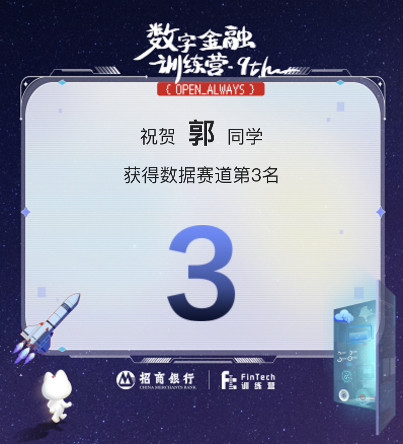
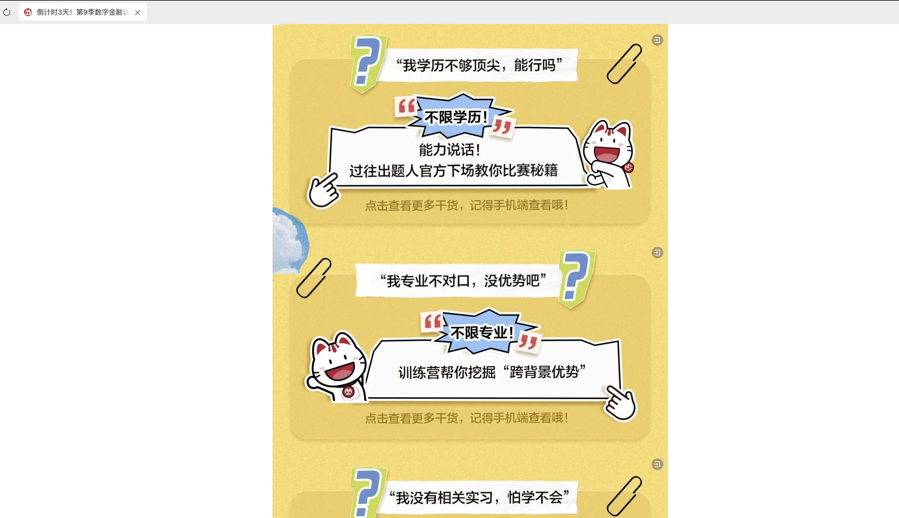

# 第9届招行银行数字金融训练营
## 招行数字训练营数据赛道经验分享
比赛结果赛题1排20，赛题2排第3，最后总排名第3

### 赛题1思路
特征工程+autogluon自动化调参
#### 特征工程
&nbsp;&nbsp;&nbsp;&nbsp;首先做简单的EDA，查看feature都包含哪些特征、特征的类型、特征不同枚举值，是否有nan等。统计各个feature不同类别的ctr情况，选出变化比较大的feature（连续变量可以采取分箱），并且检验nan是不是有额外信息，决定后续用什么值填充。  
  
&nbsp;&nbsp;&nbsp;&nbsp;期间本人发现对于feature可能存在不符合常理的情况，比如用户的age等于0。根据经验，本人并没有对异常数值做清洗。因为test集合中其实也会存在异常值的情况，并且异常值不一定跟正常值包含相同的信息（后续对异常值处理，效果反而变差）。

&nbsp;&nbsp;&nbsp;&nbsp;特征衍生主要包括：1、根据业务角度对feature做一些加减乘除的操作，对时间变量提取天、周等信息。2、做TE、CE编码。3、从user以及ad的角度出发，统计不同user点击以及ad被点击情况下，feature有什么区别。（2、3均使用Kfold避免数据泄露）。
  
&nbsp;&nbsp;&nbsp;&nbsp;特征选择主要用的是lgb去做特征选择，因为lgb跑的比较快，省时间，能试更多的特征。
#### autogluon模型
&nbsp;&nbsp;&nbsp;&nbsp;autogluon支持自动化的模型训练，可以节省很多调节模型参数的时间。内部支持各种树、KNN、NN等模型，并自动将模型做集成。本人在跑模型的时候，采取compute_sample_weight缓解样本不平衡的问题，以AUC为评估指标，采取5折的kfold，限制模型运行时间避免过拟合。最后取得了一个比较不错的分数。
#### 不足：
1、没有去检验train跟test集的feature分布是否相同。一开始觉得train跟test的user跟ad feature都来自同一个数据集就没做，后续想想好像还是有必要的

2、没有用到点击的时序信息。做TE以及统计不同user点击以及ad被点击情况的时候，没有考虑时序，而是当成截面处理

3、本人不太会数据清洗，这个可能也是一个提升点
### 赛题2思路
Roberta架构下的MLM任务+分类任务
#### NLP主要方法
&nbsp;&nbsp;&nbsp;&nbsp;NLP的处理主要包括：词袋词频统计、TF-IDF、LDA、Embedding等方法。其中词袋、TF-IDF只会孤立的考虑每个词的影响，Embedding等方法会结合上下文语意进行分析。本次给到的数据形式是文本被直接分词并通过词典映射后的结果，因此本人立马想到的就是使用Embedding的方法进行词向量的从新训练。
#### MLM预训练+分类任务
&nbsp;&nbsp;&nbsp;&nbsp;考虑到仅仅只通过分类任务去训练网络效果不好，因此在进行分类任务训练之前，首先采用了合并train跟test做MLM的方法进行无监督学习。期间上游结构采取了bert跟roberta的架构，下游采取了提取CLS向量、平均池化等方法。由于数据量比较少，train只有8k，非常容易过拟合，因此本人通过加入dropout层、以及减小模型参数、采取KFOLD等方法来避免过拟合的问题，对于本题而言KFOLD非常重要，前期测试KFOLD可以很大程度提升F1 0.77->0.8。最后，通过不断尝试，采取Roberta+提取CLS向量的方式取得了非常不错的分数。
#### 不足
1、没有尝试别的方法，一直死磕MLM+分类的任务

2、同时没有采取ensemble的方法（提交了几次，效果变差了）。
 
### 心路历程
&nbsp;&nbsp;&nbsp;&nbsp;前三天，都还可以，一直在20名左右徘徊，虽然有的时候会掉到50多甚至100多名，但每次提交都能涨回去。第四天，极度痛苦，注意力一直着重于特征工程，两个题怎么提也提不上去，看见自己的名次降到60多跟30多（其中有个小情况是，第一名的排名下降速度明显快于第二题，总有种感觉是一些人在组队讨论分享思路等，不过没有证据，自己的一种心理慰藉）。第五天，本来打算放平心态，结果灵光乍现，想到了第一个题可能欠拟合，而非特征工程不充分，因此增加了模型的训练时间；第二个题改变了调节学习率的策略，同时通过略微提高正则的权重，在最后的4h里提高到了一个很高的分数。运气有点好......
### 结果🥲
&nbsp;&nbsp;&nbsp;&nbsp;数据赛道第三名，拼尽全力但并没有收到面试通知，有些难过，因为比赛结束，自己认为9本两财硕的学历肯定能直接拿到面试机会。我可以接受筛选简历的行为，但是这一步为什么要发生在比赛之后。我相信招行本身希望通过训练营选拔拔尖的金融科技人才，同时大部分同学参加这个比赛为的就是最后能够拿到招行数字金融生的提前批机会，所以大家才在5天的时间里拼尽全力希望能够向招行展现自己的实力以作为后续拿到提前批的保障。后续在xhs上跟一些志同道合的同学沟通以后，发现有很多高名次并且学历好的同学也没有拿到面试通知，不禁开始对招行举办数字金融训练营的意义产生了怀疑，被招行以及以往的学长学姐吹的天花乱坠的比赛，却以这样结局收场，让人大失所望。

&nbsp;&nbsp;&nbsp;&nbsp;自己也尝试拨打招行的招聘电话寻求原因，但回复仅仅是自己没有进入面试，并没有具体的理由。而某位背景跟排名都很不错的女生在询问以后却被告知，排名仅考虑了第一题跟第二题的结果，而进入面试需要对三道题进行综合考虑，由于其第三题附加题做的不好，因此没有进面。听到这个理由，我不禁想问，既然最后需要考虑附加题的成绩，那么为什么要多此一举，在排名的时候不考虑第三题的成绩，并且在比赛途中第三题的提交不给予测评分数。做成黑箱不便于服众，这不是三岁小孩都知道的道理吗，堂堂招总居然搞出这样的弱智问题，可见招行国内第一股份制银行的头衔徒有虚名，数字化转型、建设数智银行的口号更是假大空。演都不演了.............

&nbsp;&nbsp;&nbsp;&nbsp;经过几天的休整，自己也逐渐释怀，说到底招行银行还是属于金融行业，金融行业招人发生什么都不足为奇。因此本人在这里奉劝后续计划参加招行数字金融训练营的人，别把训练营的结果看的太重，训练营本身的评选并不透明。拿到200左右的名次就足以保证进面的需求，没有必要拼尽全力去提高名次。如果希望多拿钱，那么可以去努力提高名次，剩下的就是听天由命。

&nbsp;&nbsp;&nbsp;&nbsp;最后，在这里许下一个愿望，从2025开年到如今5月就业一直不顺利，总是出现各种意想不到的结果，希望自己在后续就业过程中能遇到一个真正的伯乐，提供给自己一个施展抱负的平台。人有冲天之志，非运不能自通🙏🙏🙏🙏🙏

### Update 2025.05.20
&nbsp;&nbsp;&nbsp;&nbsp;通过跟多位同学沟通交流，得出的结论是招商银行根本不在乎数字训练营最后谁进面。最后进面跟关系户也无任何关系，任何流程都接近于随机，无论是复赛进面还是AI赛道初赛等。

以下为一些证据case，case隐私处理：

1、招行可能没有料到，有某一位同学恰好找到了一位赛题1、2排名跟他恰好基本相同的同学，且这位同学没有交第三题，最后交了第三题的同学排名很靠前，而没交第三题的同学排名200开外。因此排名肯定是综合排名，招行在说谎

2、某位进面的同学的官网简历仅寥寥几笔，只写了1-2个小公司的实习经历同样进面，同时也有0实习的同学进面

3、部分进面的同学直接拿认识同学的代码提交（不知道有无大改），提供代码同学未进面，拿代码的同学进面

4、某位AI赛道同学讲AI赛题只能牛客代为测评，自己也不知道测评结果

5、AI初赛有些没怎么写的人也能进入复试

&nbsp;&nbsp;&nbsp;&nbsp;招行可能千算万算也没想到学生之间会进行交流，如今训练营答疑群还未接触禁言，我们是否可以理解为掩耳盗铃的一种行为。并且连基本的“您好！您数字金融训练营数据赛道排名”这样的邮件也不敢发一个，导致很多没有收到面试通知的同学连排名出了都不清楚。难不成招行就是为了先把生米煮成稀饭，然后没进面的同学后知后觉，你们可以以面试已结束进行搪塞？招行这种不把学生当人，随意践踏学生努力的行为，居然在通话的时候也敢强调自己招行数字金融训练营的《口碑》，真是小丑至极.........

### 招行小丑推文

&nbsp;&nbsp;&nbsp;&nbsp;朝令夕改，言而无信
